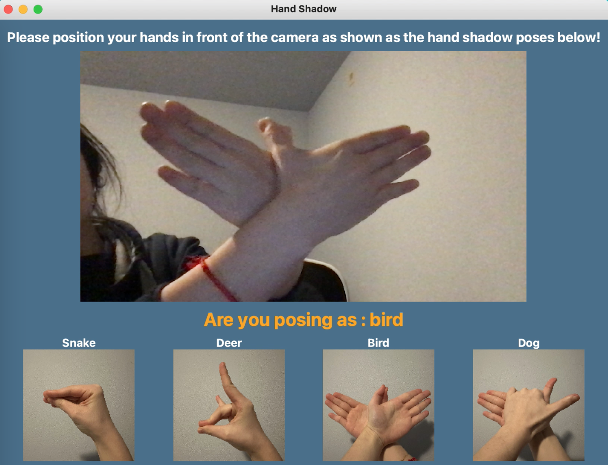

# HandShadow
Interactive hand shadow teaching assistant based on hand pose recognition

Final project for TECHIN513

Group 1 members: Jiawen Chen, Kaiwen Men, Louisa Shi

## Objective

To develop an interactive teaching assistant system that leverages machine learning and computer vision technologies to enhance children’s image recognition skills and teach them the art of hand shadow play.

## Run 
```
pip install -r requirements.txt
python hand_shadow.py
```
## Demo


